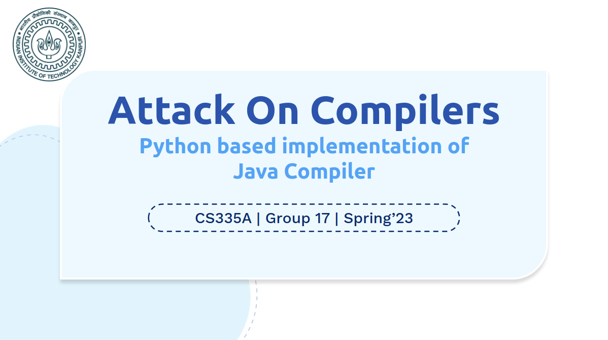

### attack-on-compilers

# studious-java

JAVA compiler implementation in python for x86-64 architecture using PLY (Python-Lex-Yacc)

## Report

Quickstart: run make ARG=test_number to run
Can instead use make dev ARG=test_number to generate verbose outputs and complete parse tree
To view the generated parse tree/ast use make graph

Further instructions file [report](./doc/report.pdf) to execute the compiler can be found in `/doc` directory

## Team Members:

- [Harshit Raj](https://1-harshit.github.io) (200433)
- Kumar Arpit (200532)
- Akshan Agrawal (180061)

## About the project

- Course Project for CS335A (Compiler Design) at IIT Kanpur
- 2022-23 Spring Semester
- Instructor: Prof. Swarnendu Biswas
- TA: Mr. Dinkar Tewary

## Project Structure

- Milestone 1: Lexer and Parser
- Milestone 2: Symbol Table, Type Checking and Three Address Code Generation
- Milestone 3: Memory Allocation
- Milestone 4: Code Generation

## Evaluation

Marks obtained in each milestone:

- Milestone 1: 95%
- Milestone 2: 100%
- Milestone 3: 90%
- Milestone 4: 100%
- Bonus Milestone: 100%

Overall: 97%
